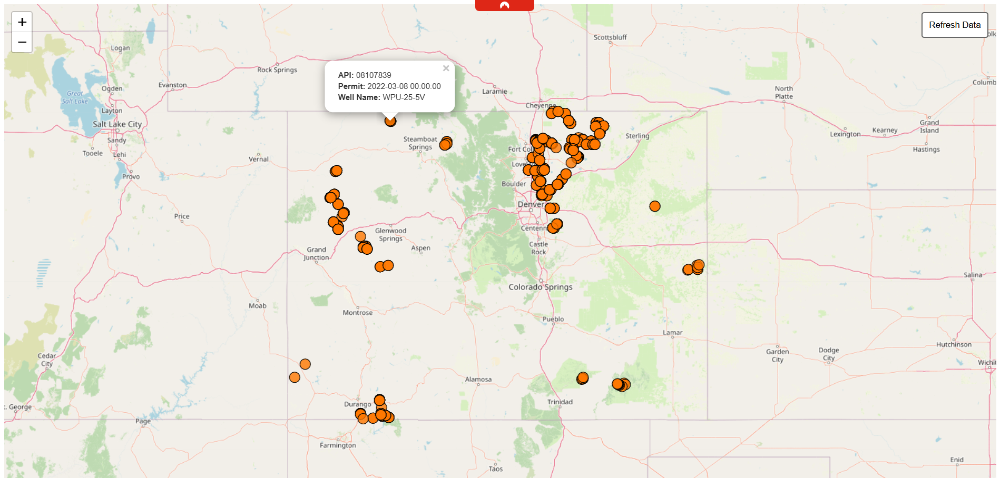

# Colorado Well Permits Map

An interactive web application for visualizing and managing Colorado well permit data. This application provides a user-friendly interface to view well permits on a map and includes functionality to synchronize with the official Colorado state database.


## Description

The Colorado Well Permits Map Application is a full-stack web application that offers:

- Interactive map visualization of well permit locations across Colorado
- Automatic data synchronization with the official Colorado state database
- Efficient spatial data storage using PostGIS
- RESTful API endpoints for accessing well permit data
- Visualization of permit information

### Key Features

- Interactive Leaflet.js map interface
- Automatic data refresh functionality
- GeoJSON API endpoints for permit data
- Efficient spatial queries using PostGIS
- Popup information for individual well permits
- Responsive web design

## Requirements

- Python 3.11
- PostgreSQL 16+ with PostGIS extension
- Required Python packages:
  - FastAPI
  - SQLAlchemy
  - GeoPandas
  - Uvicorn
  - Requests


## Setup and Installation

1. Clone the repository:

git clone https://github.com/Flipadelphia-90/WellPermits
cd wellpermits

2. Create and activate a virtual environment(Windows):
python -m venv venv

.\venv\Scripts\activate  

4. Install required packages:
pip install -r requirements.txt

5. Set up PostgreSQL database:
   - Install PostgreSQL(16)+ and PostGIS extension
   - Create a new database
   - Enable PostGIS extension for the database:
     ```sql
     CREATE EXTENSION postgis;
     ```
   - Alter database credientails in settings.py

## Running the Application

1. Start the FastAPI server:
uvicorn main:app --reload

2. Open your web browser and navigate to:
http://localhost:8000

3. To refresh the well permit data, click the "Refresh Data" button in the top-right corner of the map.

## API Endpoints

- `GET /`: Main map interface
- `GET /api/permits`: Retrieve well permit data as GeoJSON
- `POST /api/refresh`: Trigger data refresh from Colorado state database
